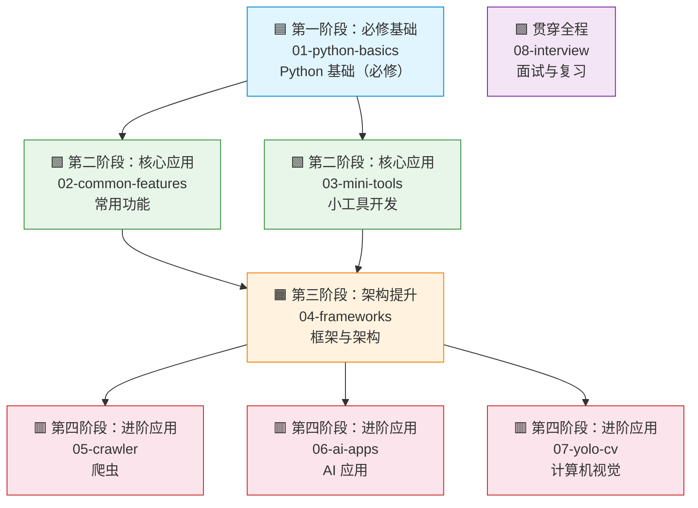

# Python 学习知识库

> 🎯 本知识库通过系统性的学习路径和大量实战代码, 帮助你快速掌握 Python 并应用于工作、AI、计算机视觉、爬虫等领域。(涉及java参考对比)

## 学习路径图



## 模块导航

| 模块 | 描述 | 前置条件 | 阶段 |
|------|------|----------|------|
| [01-python-basics](01-python-basics/) | Python 基础语法与核心概念，与 Java 对比学习 | 无 | 🟦 第一阶段 |
| [02-common-features](02-common-features/) | 正则、日期、JSON、数据库、API、测试、日志等常用功能 | 01-python-basics | 🟩 第二阶段 |
| [03-mini-tools](03-mini-tools/) | 文件处理、Excel/CSV、PDF、自动化脚本等实用小工具 | 01-python-basics | 🟩 第二阶段 |
| [04-frameworks](04-frameworks/) | Django、FastAPI、Flask、Celery、SQLAlchemy 等框架与架构 | 01-python-basics, 建议完成第二阶段 | 🟧 第三阶段 |
| [05-crawler](05-crawler/) | requests、BeautifulSoup、Selenium、Scrapy 等爬虫技术 | 01-python-basics, 建议完成第二三阶段 | 🟥 第四阶段 |
| [06-ai-apps](06-ai-apps/) | NumPy、Pandas、LLM API、LangChain、RAG、AI Agent | 01-python-basics, 建议完成第二三阶段 | 🟥 第四阶段 |
| [07-yolo-cv](07-yolo-cv/) | OpenCV、YOLO 目标检测、模型训练与微调 | 01-python-basics, 建议完成第二三阶段 | 🟥 第四阶段 |
| [08-interview](08-interview/) | 面试题集（初/中/高级）、速查卡片、Java 对比速查表 | 无（贯穿全程） | 🟪 贯穿全程 |

## 快速查找表

### 🏷️ 面试常考

| 知识点 | 模块 | 说明 |
|--------|------|------|
| [Python 与 Java 核心差异](01-python-basics/10-java-python-diff/) | 01-python-basics | 类型系统、内存管理、并发模型等核心差异对比 |
| [装饰器详解](01-python-basics/04-functions-decorators/) | 01-python-basics | 装饰器原理、自定义装饰器、常用内置装饰器 |
| [列表推导式与生成器](01-python-basics/09-comprehensions-generators/) | 01-python-basics | 推导式语法、生成器函数、yield 关键字 |
| [异常处理](01-python-basics/07-exception-handling/) | 01-python-basics | try/except/finally、自定义异常、上下文管理器 |
| [面向对象](01-python-basics/05-oop/) | 01-python-basics | 类定义、继承、多态、魔术方法、dataclass |
| [正则表达式](02-common-features/01-regex/) | 02-common-features | re 模块核心函数、常用模式 |
| [单元测试](02-common-features/06-testing/) | 02-common-features | pytest 框架、fixture、参数化测试 |
| [初级面试题](08-interview/01-basic/) | 08-interview | 数据类型、装饰器、GIL、作用域等基础面试题 |
| [中级面试题](08-interview/02-intermediate/) | 08-interview | 框架选型、ORM、异步编程、API 设计等中级面试题 |
| [高级面试题](08-interview/03-advanced/) | 08-interview | 元类、描述符、RAG、YOLO、微服务容错等高级面试题 |
| [Python 与 Java 差异速查表](08-interview/java-python-diff-cheatsheet.md) | 08-interview | 高频面试对比话题速查 |

### 🏷️ 工作常用

| 知识点 | 模块 | 说明 |
|--------|------|------|
| [JSON/YAML/XML 数据处理](02-common-features/03-data-formats/) | 02-common-features | 数据格式解析与生成 |
| [数据库操作](02-common-features/04-database/) | 02-common-features | SQLite/MySQL/PostgreSQL 连接与操作 |
| [HTTP API 开发](02-common-features/05-http-api/) | 02-common-features | FastAPI 和 Flask REST API 开发 |
| [日志管理](02-common-features/07-logging/) | 02-common-features | logging 模块配置与使用 |
| [文件批量处理](03-mini-tools/01-file-batch/) | 03-mini-tools | 文件批量重命名、格式转换 |
| [Excel/CSV 处理](03-mini-tools/02-excel-csv/) | 03-mini-tools | openpyxl/pandas 数据处理 |
| [PDF 操作](03-mini-tools/03-pdf-tools/) | 03-mini-tools | PDF 合并、拆分、文本提取 |
| [Web 框架](04-frameworks/01-web-frameworks/) | 04-frameworks | Django/FastAPI/Flask 对比与实战 |
| [ORM 框架](04-frameworks/03-orm/) | 04-frameworks | SQLAlchemy/Django ORM 数据库操作 |
| [定时任务](04-frameworks/06-scheduler/) | 04-frameworks | APScheduler/Celery Beat 任务调度 |
| [异步与任务队列](04-frameworks/02-async-task-queue/) | 04-frameworks | Celery、asyncio、RQ 异步处理 |
| [消息队列](04-frameworks/04-message-queue/) | 04-frameworks | RabbitMQ、Redis、Kafka 集成 |
| [技术栈选型指南](04-frameworks/tech-stack-guide.md) | 04-frameworks | 按项目类型推荐框架组合 |

### 🏷️ AI 入门

| 知识点 | 模块 | 说明 |
|--------|------|------|
| [NumPy 基础](06-ai-apps/01-numpy-basics/) | 06-ai-apps | 数组创建与基础运算（入门铺垫） |
| [Pandas 基础](06-ai-apps/02-pandas-basics/) | 06-ai-apps | DataFrame 数据读取与操作（入门铺垫） |
| [Matplotlib 绘图](06-ai-apps/03-matplotlib/) | 06-ai-apps | 基础图表绘制（入门铺垫） |
| [LLM API 调用](06-ai-apps/05-llm-api/) | 06-ai-apps | OpenAI API 调用与流式响应（应用入门） |
| [Prompt Engineering](06-ai-apps/06-prompt-engineering/) | 06-ai-apps | 提示词工程基础技巧（应用入门） |
| [LangChain 对话链](06-ai-apps/07-langchain/) | 06-ai-apps | 构建对话链（应用入门） |
| [RAG 检索增强生成](06-ai-apps/08-rag/) | 06-ai-apps | 文档加载、向量化、知识库问答（应用进阶） |
| [AI Agent 智能体](06-ai-apps/09-ai-agent/) | 06-ai-apps | LangChain Agent、Function Calling（应用进阶） |
| [YOLO 目标检测](07-yolo-cv/03-yolo-detection/) | 07-yolo-cv | 使用 Ultralytics 进行目标检测 |
| [实用 AI 应用](06-ai-apps/10-practical-ai/) | 06-ai-apps | 文本分类、图像生成、语音识别（应用进阶） |
| [OpenCV 图像基础](07-yolo-cv/01-opencv-basics/) | 07-yolo-cv | 图像读取、颜色空间、基础操作 |

## 各模块前置依赖说明

```
第一阶段（必修）
└── 01-python-basics ← 无前置条件，所有后续模块的必修基础

第二阶段（核心应用，完成第一阶段后可并行学习）
├── 02-common-features ← 前置：01-python-basics
└── 03-mini-tools      ← 前置：01-python-basics

第三阶段（架构提升，建议完成第二阶段后学习）
└── 04-frameworks      ← 前置：01-python-basics，建议完成 02 + 03

第四阶段（进阶应用，建议完成第二三阶段后学习，以下可并行）
├── 05-crawler         ← 前置：01-python-basics，建议完成 02 + 03 + 04
├── 06-ai-apps         ← 前置：01-python-basics，建议完成 02 + 03 + 04
└── 07-yolo-cv         ← 前置：01-python-basics，建议完成 02 + 03 + 04

贯穿全程
└── 08-interview       ← 无前置条件，可在任意阶段参考使用
```

## 知识图谱工具

本项目提供自动生成知识图谱和思维导图的工具，位于 `tools/` 目录下。

### 生成思维导图

```bash
# 生成 Mermaid 格式思维导图（默认扫描项目根目录）
python tools/generate_mindmap.py

# 指定扫描目录
python tools/generate_mindmap.py --dir ./01-python-basics
```

### 生成交互式知识图谱

```bash
# 生成可交互的知识图谱 HTML 文件
python tools/generate_knowledge_graph.py

# 指定扫描目录
python tools/generate_knowledge_graph.py --dir ./01-python-basics
```

生成的 `knowledge_graph.html` 文件可直接在浏览器中打开，支持：
- 🖱️ 节点拖拽和缩放
- 🎨 不同颜色区分学习阶段（蓝色=第一阶段，绿色=第二阶段，橙色=第三阶段，红色=第四阶段）
- ➡️ 有向边表示模块间的前置依赖关系
- 🔗 点击节点跳转到对应知识点

### 重新生成可视化

当知识库内容更新后（新增模块、修改目录结构等），建议重新生成可视化文件以保持同步：

```bash
# 重新生成思维导图
python tools/generate_mindmap.py

# 重新生成交互式知识图谱
python tools/generate_knowledge_graph.py
```

### 自定义配置

工具支持通过命令行参数自定义行为，详见各脚本的 `--help` 输出：

```bash
python tools/generate_mindmap.py --help
python tools/generate_knowledge_graph.py --help
```

> 💡 这两个工具是通用型的，可复用于任意 Markdown 项目的目录结构可视化，不限于本知识库。

## 环境搭建

### 快速开始

```bash
# Linux/Mac
chmod +x setup_env.sh
./setup_env.sh

# Windows
setup_env.bat
```

### 手动搭建

```bash
# 1. 确认 Python 版本 >= 3.9
python --version

# 2. 创建虚拟环境
python -m venv venv

# 3. 激活虚拟环境
source venv/bin/activate  # Linux/Mac
venv\Scripts\activate     # Windows

# 4. 安装依赖
pip install -r requirements.txt
```

## 建议与支持

如果本知识库对你有帮助，欢迎 [提 Issue](https://github.com/skyhe58/python-learning-guide/issues) 提出建议，或请作者喝杯咖啡 ☕

| 微信支付 | 支付宝 |
|:---:|:---:|
| {: style="width:200px"} | {: style="width:200px"} |

## 许可证

本项目仅供学习和个人使用。
